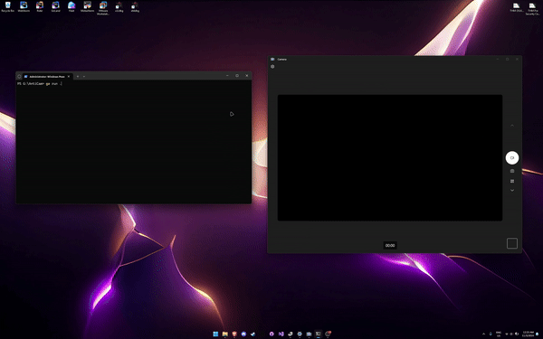

# AntiCam

**AntiCam** is a tool designed to list all connected cameras on a Windows device and enable or disable them as needed. This utility allows quick management of camera devices without needing to navigate through Device Manager.



## Features

- **Device Detection**: Lists all connected camera devices with details.
- **Enable/Disable Cameras**: Allows users to enable or disable specific cameras.
- **Simple Interaction**: Provides a command-line interface for straightforward use.

## Platforms
| Platform       | Supported | Tested |     Version     |
|----------------|:---------:|:------:|:---------------:|
| Windows        |     ✅     |   ✅    | Windows 11 24H2 |
| Linux          |     ❌     |   ❌    |        ❌        |
| macOS          |     ❌     |   ❌    |        ❌        |

## Installation

1. **Clone the Repository**:
   ```bash
   git clone https://github.com/9dl/AntiCam.git
   cd anticam
   ```

2. **Install Dependencies**:
   Install the WMI package required for Windows device queries:
   ```bash
   go get github.com/StackExchange/wmi
   ```

3. **Build the Project**:
   ```bash
   go build -o anticam
   ```

4. **Run the Tool**:
   ```bash
   ./anticam
   ```

## Usage

When run, AntiCam will list all connected camera devices. Users can then select a device by its ID and choose to enable or disable it via a command-line prompt.
